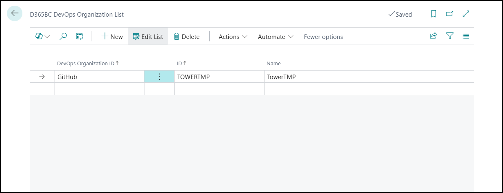
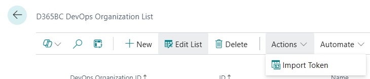
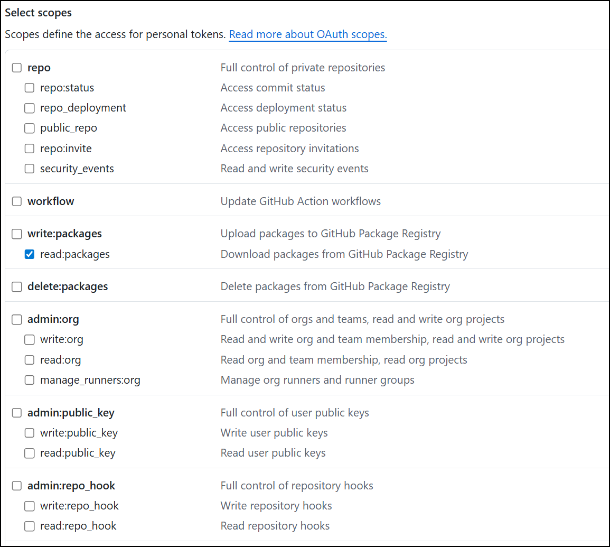

# DevOps Organizations

To get information about PTE apps versions we need to know the PTE's devops environment.

Here you kan add information about your environments.

This page contains this fields:

**Devops Organization ID** - This is the type of the Devops example GitHub or Azure
**ID** Internal ID for this organization. 
**Name** - This is the actual name of the organization.

## Menu

**Import Token** - This action opens a dialog for importing a Personal Access Token (PAT) for use
                 with Github repositories.

## Github Token

To get it work the classic PAT needs this configuration:

