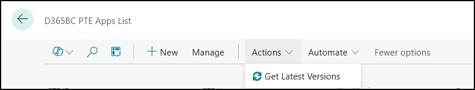
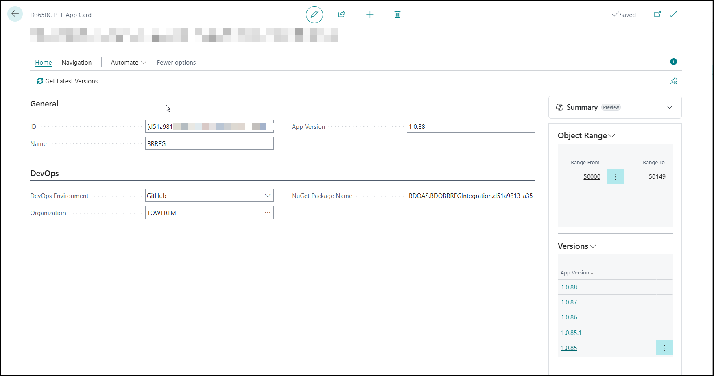
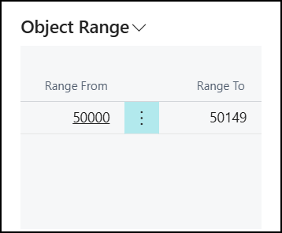
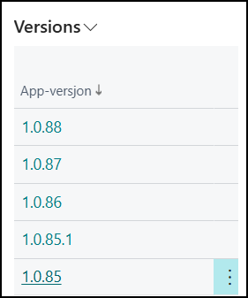

# Cloud Customer Management Solution

## PTE Apps

### General setup information
All PTE apps needs to be connected to a [Devops Organization](DevOpsOrganization.md) so that it can retrieve nuget package information.

## Fields

**PTE ID** - The apps id (guid) from app.json 
**PTE Name** - The name of the app.
**App Version** - The apps latest version.
**Range From** - The start object id from the object range found in app.json 
**Range To** - The end object id from the object range found in app.json.
**DevOps Environment** - The type of devops the app is maintained in eks (Github,Azure).
**DevOps Organization** - The organization from the devops that is maintaining the app.
                        See General setup information about Devops organizations.
                        
**Package** - This information is for Azure devops for getting version info.
**Feed** -  This information is for Azure devops for getting version info.

## Menu

**Get Latest Versions** - This gets the information about the latest versions of this app.

## Factboxes

### Object RAnges

This shows the object ranges for this app.

### App Versions

